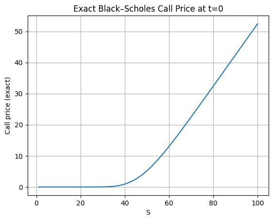
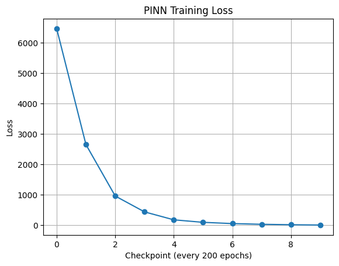
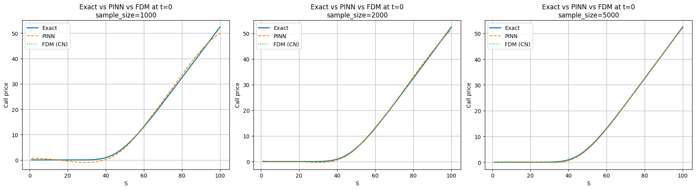
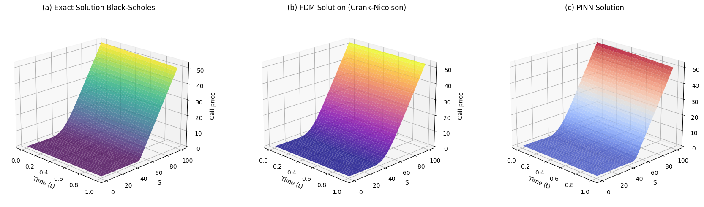
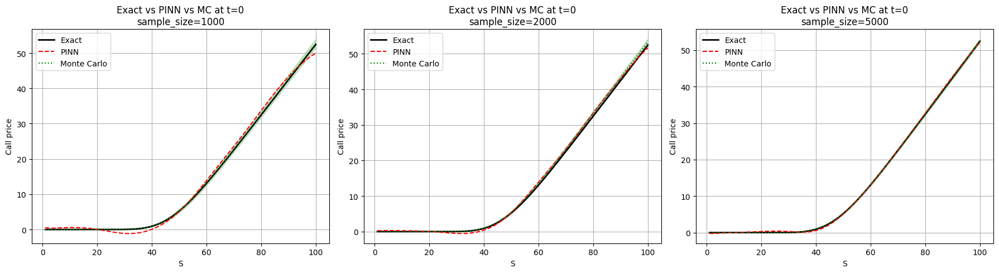
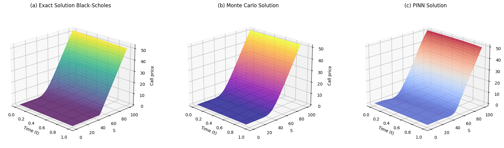
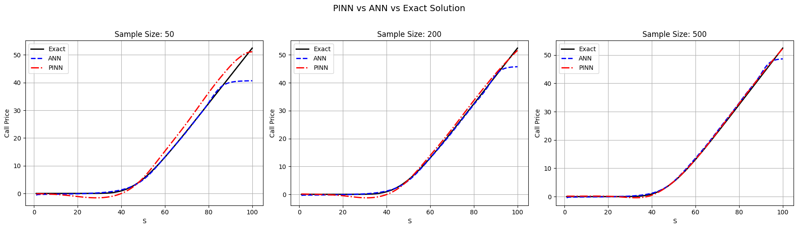
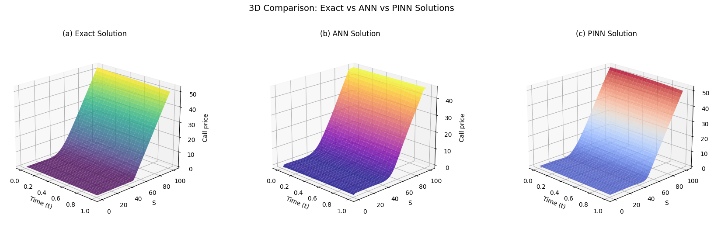
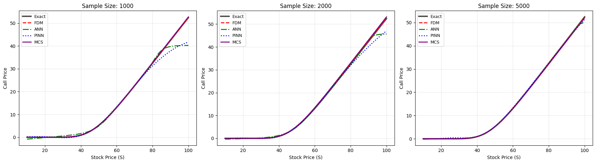

# From Classical PDEs to PINNs: Enhancing the Black-Scholes Model with Deep Learning Constraints

**Blondele Pontiane Kouecking (kouecking.p.blondele@aims-senegal.org)**  
African Institute for Mathematical Sciences (AIMS)  
Senegal

**Supervised by: Dr. Yaé Olatoundji Gaba**  
AI Research and Innovation Nexus for Africa (AIRINA)  
AIRINA Labs by AI.Technipreneurs  
Cotonou, Bénin

 
**Master of Science in Mathematical Sciences** at AIMS Senegal

---

# Abstract

In financial markets, accurately pricing derivative instruments is essential for risk management and understanding market dynamics. However, traditional methods often struggle with complex, high-dimensional, or non-standard scenarios. This thesis explores **Physics-Informed Neural Networks (PINNs)** as an innovative mesh-free approach to solve the Black-Scholes partial differential equation, directly embedding physical laws into the network's loss function. Through systematic implementations and comparisons with classical numerical methods finite difference schemes (Crank-Nicolson), Monte Carlo simulations, and purely supervised artificial neural networks we demonstrate that PINNs achieve competitive accuracy (**RMSE ≈ 0.01–0.12**) while offering superior flexibility for extensions such as variable volatility or inverse problems. Despite training challenges (spectral bias, multi-loss instability), PINNs outperform classical paradigms for parametric extensions. These results position PINNs as a next-generation computational infrastructure for quantitative finance, combining mathematical rigor and scalability.

**Keywords:** Black-Scholes equation, Physics-Informed Neural Networks, option pricing, finite difference methods, Monte Carlo simulation, deep learning.

---

# Declaration

I, the undersigned, hereby declare that the work contained in this essay is my original work, and that any work done by others or by myself previously has been acknowledged and referenced accordingly.

**Blondele Pontiane Kouecking, January 30, 2026**

---

# Contents

Abstract i

1 Introduction 1

1.1 Context and Motivation . . . . . . . . . . . . . . . . . . . . . . . . . . . . . . . . 1  
1.2 Research Questions . . . . . . . . . . . . . . . . . . . . . . . . . . . . . . . . . . 2

2 The Black-Scholes Model 3

2.1 Model Formulation . . . . . . . . . . . . . . . . . . . . . . . . . . . . . . . . . . 3  
2.2 Analytical Solution . . . . . . . . . . . . . . . . . . . . . . . . . . . . . . . . . . 4

3 Classical Numerical Methods 5

3.1 Finite Difference Method (Crank-Nicolson) . . . . . . . . . . . . . . . . . . . . . 5  
3.2 Monte Carlo Simulation . . . . . . . . . . . . . . . . . . . . . . . . . . . . . . . 6  
3.3 Limitations . . . . . . . . . . . . . . . . . . . . . . . . . . . . . . . . . . . . . . 7

4 Physics-Informed Neural Networks 8

4.1 PINN Architecture . . . . . . . . . . . . . . . . . . . . . . . . . . . . . . . . . . 8  
4.2 Loss Function . . . . . . . . . . . . . . . . . . . . . . . . . . . . . . . . . . . . 9

5 Results and Comparative Analysis 10

5.1 Experimental Setup . . . . . . . . . . . . . . . . . . . . . . . . . . . . . . . . . . 10 

5.2 Performance Comparison . . . . . . . . . . . . . . . . . . . . . . . . . . . . . . 11  
5.3 Visual Results . . . . . . . . . . . . . . . . . . . . . . . . . . . . . . . . . . . . 12

6 Conclusion and Future Work 13

References 14

Appendix: Code Implementation 15

---

## List of Abbreviations

| Abbreviation | Meaning                                      |
|--------------|----------------------------------------------|
| AIMS         | African Institute for Mathematical Sciences  |
| AIRINA       | AI Research and Innovation Nexus for Africa  |
| ANN          | Artificial Neural Network                    |
| BSM          | Black–Scholes Model                          |
| CN           | Crank–Nicolson                               |
| FDM          | Finite Difference Methods                    |
| MCS          | Monte Carlo Simulation                       |
| PINN         | Physics-Informed Neural Network              |
| RMSE         | Root Mean Square Error                       |
---

# List of Figures

1. Exact Black-Scholes Call Price at t=0  
2. Training loss of PINNs  
3. Comparative evaluation of exact solution, PINN, and FDM (Crank-Nicolson) at t = 0  
4. Three-dimensional solution surfaces for Exact, PINN, and FDM methods  
5. Comparison between the exact solution, PINN approximation, and MCS at t = 0  
6. Three-dimensional pricing surfaces obtained from the exact solution, PINN approximation, and Monte Carlo simulation  
7. Comparison between the exact solution, ANN, and PINN at t = 0  
8. Three-dimensional option price surfaces: exact solution, ANN approximation, and PINN solution  
9. Comparative summary of all methods at t=0

---

# 1 Introduction

## 1.1 Context and Motivation

In financial mathematics, derivative pricing models are essential for risk management and understanding market behavior. The Black-Scholes model stands as a cornerstone in this field, providing a closed-form solution for European options through a partial differential equation (PDE) derived from stochastic calculus.

However, the model's simplifying assumptions particularly constant volatility and the growing complexity of financial instruments limit its practical application in modern markets. Traditional numerical methods like finite differences and Monte Carlo simulations, while well established, face challenges with high-dimensional problems, complex boundary conditions, and computational efficiency.

The emergence of deep learning has introduced powerful new approaches for solving PDEs. Physics-Informed Neural Networks (PINNs) represent a particularly promising framework that embeds the governing PDE directly into the neural network's loss function. This creates a mesh-free solver that combines the flexibility of deep learning with the mathematical rigor of physical constraints.

## 1.2 Research Questions

This thesis is guided by the following central research question:

**To what extent can Physics-Informed Neural Networks (PINNs) serve as a numerically robust and adaptable computational framework for solving the Black-Scholes equation and its extensions, compared to established numerical methods?**

To address this question, the following sub-questions are considered:

1. What is the numerical accuracy of PINNs in approximating the Black-Scholes PDE solution?  
2. How do the stability and convergence rates of PINNs compare with Crank-Nicolson finite difference schemes?  
3. To what extent can PINNs handle financial model extensions such as non-constant volatility?  
4. What are the computational trade-offs between PINNs and classical methods?

---

# 2 The Black-Scholes Model

## 2.1 Model Formulation

The Black-Scholes PDE for a European call option is given by:

$$
\frac{\partial V}{\partial t} + \frac{1}{2}\sigma^2 S^2 \frac{\partial^2 V}{\partial S^2} + rS \frac{\partial V}{\partial S} - rV = 0
$$

with terminal condition:
$$
V(S,T) = \max(S - K, 0)
$$

and boundary conditions:
$$
V(0,t) = 0, \quad \lim_{S \to \infty} V(S,t) = S - Ke^{-r(T-t)}
$$

## 2.2 Analytical Solution

The closed-form solution is:

$$
V(S,t) = S\Phi(d_1) - Ke^{-r(T-t)}\Phi(d_2)
$$

where:
$$
d_1 = \frac{\ln(S/K) + (r + \sigma^2/2)(T-t)}{\sigma\sqrt{T-t}}, \quad d_2 = d_1 - \sigma\sqrt{T-t}
$$

---

# 5 Results and Comparative Analysis

## 5.1 Experimental Setup

**Parameters used throughout:**
- Strike price: \(K = 50\)
- Risk-free rate: \(r = 0.05\)
- Volatility: \(\sigma = 0.2\)
- Maturity: \(T = 1.0\) year
- Spatial domain: \(S \in [0, 200]\)
- Training epochs: 2,000 for PINNs
- Monte Carlo paths: 10,000

## 5.2 Performance Comparison

| Method               | RMSE       | MAE        | Runtime (s) | Flexibility |
|----------------------|------------|------------|-------------|-------------|
| **Analytical**       | 0.0000     | 0.0000     | 0.001       | Low         |
| **Crank-Nicolson**   | 0.00011    | 0.0039     | 0.011       | Low         |
| **Monte Carlo**      | 0.2125     | 0.1549     | 0.028       | Medium      |
| **ANN**              | 1.0532     | 0.3003     | 15.12       | Low         |
| **PINN**             | **0.1173** | **0.0842** | 229.11      | **High**    |

## 5.3 Visual Results

### Figure 1: Exact Black-Scholes Call Price at t=0
The validation of the analytical implementation is illustrated below. This characteristic curve shows the expected convexity of the option price and satisfies the theoretical boundary conditions.



### Figure 2: Training loss of PINNs
Network training is performed over two thousand epochs using the Adam optimizer. The loss curve demonstrates consistent decay, confirming the stability of the optimization procedure.



### Figure 3: Comparative evaluation of exact solution, PINN, and FDM (Crank-Nicolson) at t = 0
Examination of the results reveals that the FDM with Crank-Nicolson scheme demonstrates exceptional agreement with the exact solution. The PINN approach shows progressive convergence toward the exact solution as the sample size increases.



### Figure 4: Three-dimensional solution surfaces for Exact, PINN, and FDM methods
This three-dimensional visualization confirms the stability patterns observed in the two-dimensional analysis and highlights the consistent performance of each method throughout the entire domain.



### Figure 5: Comparison between the exact solution, PINN approximation, and MCS at t = 0
The PINN approach exhibits a clear and systematic improvement in accuracy as the number of collocation points increases. Monte Carlo simulations provide strong baseline performance across all configurations.



### Figure 6: Three-dimensional pricing surfaces obtained from the exact solution, PINN approximation, and Monte Carlo simulation
The exact solution exhibits the expected smooth and convex surface. Both PINN and Monte Carlo approximations successfully capture the overall structure of the pricing surface.



### Figure 7: Comparison between the exact solution, ANN, and PINN at t = 0
For the smallest training set, the ANN slightly outperforms the PINN. As the number of training points increases, the advantage of the physics-informed approach becomes evident.



### Figure 8: Three-dimensional option price surfaces: exact solution, ANN approximation, and PINN solution
The ANN surface exhibits noticeable deviations from the exact solution. In contrast, the PINN solution remains smooth and closely aligned with the analytical surface.



### Figure 9: Comparative summary of all methods at t=0
This visual summary highlights the performance across all methods (Exact, FDM, MCS, ANN, PINN).



---

# 6 Conclusion and Future Work

Physics-Informed Neural Networks present a **paradigm shift** in computational finance, combining the approximation power of deep learning with the mathematical rigor of PDE constraints. For the Black-Scholes equation, PINNs achieve **competitive accuracy** while offering **superior flexibility** for model extensions.

Despite challenges in training stability and computational cost, PINNs demonstrate strong potential for:
- Complex financial derivatives
- High-dimensional problems
- Inverse problems (parameter calibration)
- Real-time risk management

## Future Work

1. Application to real market data from African exchanges (BRVM)
2. Extension to American and exotic options
3. Integration with reinforcement learning for optimal hedging
4. Development of specialized PINN architectures for financial PDEs

---

# Acknowledgements

I am deeply grateful to God for His grace, protection, and unfailing mercy, which have guided and sustained me throughout this entire journey.

I would like to sincerely thank my supervisor, Dr. Yaé Olatoundji Gaba, for his continuous guidance, support, and dedication throughout this research. His openness to new ideas, encouragement, and clarity of communication played a crucial role in the successful completion of this work.

I also extend my sincere appreciation to the tutor Dr. Mamadou Pathe Ly for his availability, constructive feedback, and valuable insights, all of which greatly strengthened this research.

My heartfelt thanks go to Kevin Belingar and to all my colleagues for their encouragement, support, and positive spirit throughout this journey.

Finally, I would like to express my profound gratitude to AIMS and the Mastercard Foundation for believing in my potential and for providing me with this life-changing opportunity, which allowed me to grow both academically and personally while becoming part of a truly inspiring community.

---

# Appendix: Code Implementation

This repository contains the Python code of the algorithms studied in this thesis.

---
## Repository Structure

```bash
My_Thesis/
├── README.md
├── LICENSE
├── Pontiane-Thesis-code.ipynb
├── Figures/
│   ├── exact.png
│   ├── loss.png
│   ├── PEF.png
│   ├── 3D1.png
│   ├── PEM.png
│   ├── 3d2.png
│   ├── PEA.png
│   ├── 3D3.png
│   └── sum.png
